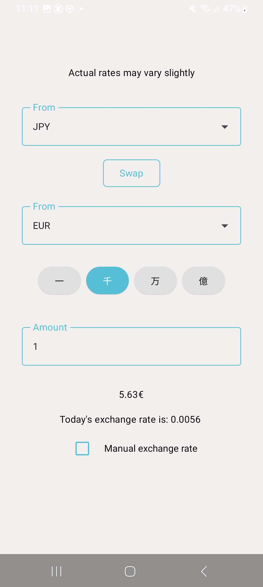
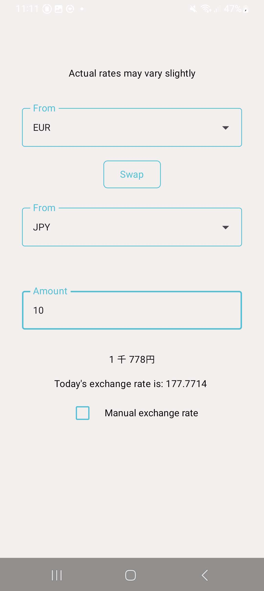

# Kansan Currency Converter

## Table of Contents
- [Overview](#overview)
- [Technologies](technologies)
- [Requirements](requirements)
- [Install & Run](install--Run)
- [Contributing](contributing)

## Overview
Kansan is a currency conversion application with releases on Web and Android. With a focus on conversions between JPY and other currencies, it allows easy conversions without using a japanese keyboard or writing
long strings of text and numbers. The web-specific UI is currently in development.

**Features:**
- Currency input with Japanese numeric conventions
- Currency output with Japanese numeric conventions
- Manual override for currency rates
  
**Supported Languanges:**
- English
- Japanese

The conversions are close approximations of the actual currency values. However for normal use cases the conversions are almost 1:1 with the rates found on search engines, with differences in decimals at most. 
Data for conversion rates is updated once an hour.

If your currency is missing and you want it added, contact me or create an issue.

 

## Technologies
**Backend:** TypeScript, Cloudflare workers

**Frontend:** Kotlin, Kotlin multiplatform

## Requirements
These all come packaged with Intellij IDEs such as Android studio or Intellij IDEA which is why they are strongly recommended, if using Ultimate or Community edition, Android plugins are needed.

`Gradle 8.14` or newer

`Java SDK 21`

`Android API 36.0` or newer

## Install & Run
1. Clone the repository
2. Build with IDE commands OR by running gradle scripts, refer to [multiplatform gradle scripts](JPY-converter/README.md)
## Contributing
For developing Intellij Idea IDE or Android studio is recommended. Please create an issue before any pull requests.
